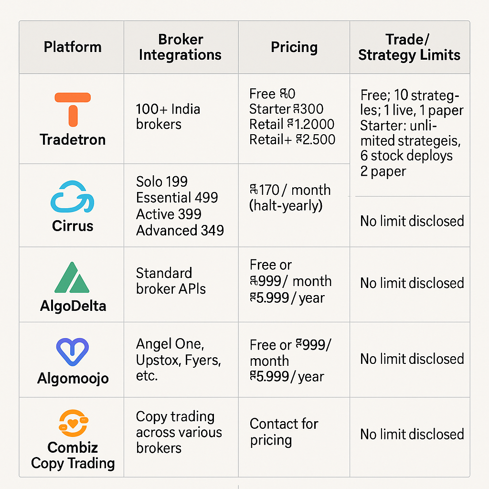

# Cross-Broker Algo Trading Platforms in India (2025)

Algorithmic trading in India has matured significantly, and a new category of tools has emerged: **cross-broker trading platforms**. These solutions allow traders to manage accounts with multiple brokers, automate strategies, and even integrate with AI-driven workflows. In this article, we summarize the major platforms available, their features, pricing, and support for APIs and AI.

---

## Why Cross-Broker Platforms?

Many Indian investors maintain **multiple Demat accounts** (average 1.6 accounts per investor, with over 192 million total accounts in FY 2025). Reasons include:

- Segregating long-term vs. trading portfolios  
- Access to different broker features and pricing  
- Boosting IPO allotment chances  
- Backup during outages  
- Tax clarity between speculative and delivery trades  

---

## Major Platforms Compared

Here’s a summary comparison of the leading platforms: **Tradetron, Cirrus, Algomojo, AlgoTradingBridge, and Combiz Copy Trading.**

### 1. **Tradetron**
- **Broker Integrations:** 100+ Indian brokers  
- **Pricing:** Free (₹0), Starter (₹300), Retail (₹1,200), Retail+ (₹2,500)  
- **Limits:** Free plan allows 10 strategies, 1 live, 1 paper deployment. Starter unlocks unlimited strategies and 5 stockbag deployments.  
- **API:** Supports external APIs/webhooks for TradingView, Amibroker, MT4, etc.  
- **AI/MCP Support:** Not available  

### 2. **Cirrus**
- **Broker Integrations:** 50+ brokers (Zerodha, Upstox, Angel One, Dhan, etc.)  
- **Pricing:** Per account — Solo (₹199), Essential (₹499), Active (₹399), Advanced (₹349), Institutional (₹299)  
- **Limits:** No explicit trade limits disclosed  
- **API:** REST & GraphQL APIs with OAuth 2.0 authentication  
- **AI/MCP Support:** Yes — only platform with public **MCP (Model Context Protocol)** support, enabling trading via AI chatbots like ChatGPT and Claude.  

### 3. **Algomojo**
- **Broker Integrations:** Angel One, Alice Blue, Fyers, Upstox, Tradejini, Zebu  
- **Pricing:** Free via partner broker accounts; else ₹999/month or ₹5,999/year  
- **Limits:** Not disclosed  
- **API:** Limited; focused on signal routing (TradingView, Amibroker)  
- **AI/MCP Support:** Not available  

### 4. **AlgoTradingBridge**
- **Broker Integrations:** 20+ brokers; compatible with TradingView, MT4/MT5  
- **Pricing:** Base package ₹5,500 + optional add-ons  
- **Limits:** Not disclosed  
- **API:** No public API documentation  
- **AI/MCP Support:** Not available  

### 5. **Combiz Copy Trading**
- **Broker Integrations:** Cross-broker copy trading framework  
- **Pricing:** Contact for details  
- **Limits:** Not disclosed  
- **API:** No public API available  
- **AI/MCP Support:** Not available  

---

## Infographics

Here are the visual comparisons generated from our research:

1. **Stock Broker Accounts in India**  
   

2. **Demat Accounts Overview**  
   

3. **Cross-Broker Platforms Overview**  
   

---

## Key Takeaways

- **Tradetron** is best for strategy creators who want a transparent structure with defined limits.  
- **Cirrus** is the most future-proof, thanks to **AI chatbot integration (MCP)** and robust APIs.  
- **Algomojo** is great if you already have a partner broker account.  
- **AlgoTradingBridge** and **Combiz** focus more on connectivity than developer flexibility.  

As algo trading adoption accelerates, cross-broker platforms will play a central role in unifying fragmented broker ecosystems in India.

---

*This article is part of our research series on algorithmic trading infrastructure in India.*
