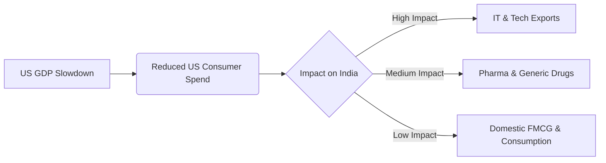

# Decoding the Impact of Global Events on the Indian Market (2026)

In 2026, the Indian stock market is no longer an island. The correlation between the Nifty 50 and global indices like the S&P 500 has reached new highs. At **Radii Labs**, we track these macro-correlations to help you navigate volatility.

From the Federal Reserve's pivot to ongoing geopolitical re-alignments, three major global forces are dictating market sentiment in Mumbai this year.

---

## 1. The Federal Reserve's "Great Pivot" 📉

After years of "higher for longer," the US Federal Reserve's aggressive rate cuts in late 2025 have flooded emerging markets with liquidity.

**Impact on India:**
*   **FII Inflows:** A weaker dollar makes Indian equities attractive. We've seen a surge in Foreign Institutional Investor (FII) buying in Q1 2026.
*   **Rupee Strength:** The INR has stabilized against the USD, reducing landed costs for importers (Oil, Electronics).

| Sector | Impact of Rate Cuts | Recommendation |
| :--- | :--- | :--- |
| **Banking (Private)** | **Positive** | Lower cost of capital globally boosts margins. |
| **IT Services** | **Neutral** | Cost benefits offset by US demand slowdown. |
| **Real Estate** | **Positive** | High correlation with interest rate cycles. |

---

## 2. The US Recession Shadow ☁️

While liquidity is up, the US real economy is cooling. Fears of a "hard landing" in the US drive volatility.

*   **The Risk:** If the US consumer stops spending, Indian exports (Textiles, Gems, IT) suffer.
*   **The Reality:** So far, data suggests a "soft landing," but market sentiment remains fragile. Any weak US jobs report triggers immediate selling in Nifty IT stocks.

---

## 3. Geopolitics: The New Normal 🌍

2026 has brought its own set of geopolitical headaches—from trade tariffs on key corridors to supply chain realignments away from China.

**India's Advantage:**
"China Plus One" is now a mature theme. Global manufacturing is shifting to India not just as a backup, but as a primary hub.
*   **Defense & manufacturing stocks** are the primary beneficiaries of this structural shift.
*   **Oil Prices:** Continued instability in the Middle East keeps crude volatile. Since India imports 80% of its oil, any spike is a direct hit to the fiscal deficit.

---

## Strategic Takeaway

The era of ignoring global cues is over. For 2026, the strategy is clear:
1.  **Ride the Rate Cut Wave**: Focus on rate-sensitive sectors like Banking and Auto.
2.  **Hedge the Recession**: Keep exposure to domestically driven sectors (FMCG, Infrastructure) which are insulated from US demand.
3.  **Watch the VIX**: Global events drive volatility. Use it to enter quality stocks at a discount.

*This analysis is part of Radii Labs' global macro watch.*