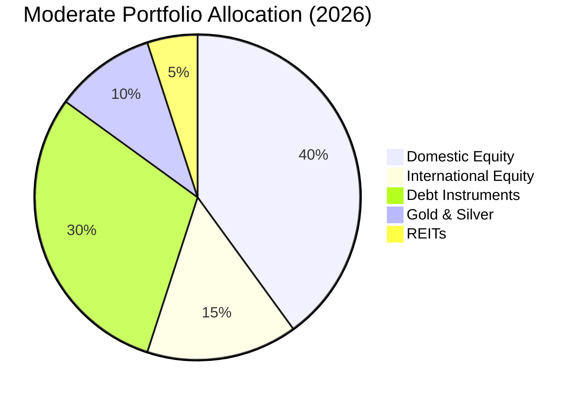

# Diversification Strategies for Indian Investors (2026 Edition)

In 2026, diversification isn't just about buying different stocks—it's about structural asset allocation. With the Nifty touching new highs and global interest rates softening, the "60/40" rule is dead.

At **Radii Labs**, we advocate for a dynamic allocation strategy that adapts to the current inflationary and geopolitical climate.

---

## 2026 Asset Allocation Models 📊

One size does not fit all. Based on current market valuations, here are our recommended structures:

| Asset Class | Aggressive (Age < 35) | Moderate (Age 35-50) | Conservative (Age > 50) |
| :--- | :--- | :--- | :--- |
| **Equity (Ind)** | 50% (Multi-cap focus) | 40% (Large-cap focus) | 30% (Blue-chips only) |
| **Equity (Intl)** | 20% (US/Emerging) | 15% (US Tech/Pharma) | 5% (Global Dividend) |
| **Debt / Bonds** | 15% (Corporate) | 30% (Short-duration) | 50% (G-Secs/FDs) |
| **Gold / Silver** | 10% (ETFs) | 10% (SGBs) | 10% (SGBs) |
| **REITs/InvITs** | 5% | 5% | 5% |

---

## The Core Pillars of 2026 Portfolios

### 1. Equity: The "Flexi-Cap" Approach
The mid-cap rally of 2025 has stretched valuations. For 2026, we prefer **Flexi-cap funds** that can pivot between large and mid-caps opportunistically.
*   **Top Pick:** Nifty 50 Index Funds for core stability, complemented by active Small-cap funds for alpha.

### 2. Gold: The Silent Guardian 🥇
Gold isn't just jewelry; it's portfolio insurance. In Jan 2026, Gold ETF inflows surpassed equity for the first time in years.
*   **Why?** Central bank buying and geopolitical hedges.
*   **How?** Sovereign Gold Bonds (SGBs) remain the tax-efficient favorite for long-term holders.

### 3. Real Estate: The Financialization Phase 🏢
You don't need crores to buy property. **REITs (Real Estate Investment Trusts)** have democratized access to Grade-A commercial real estate.
*   **Yields:** Expect 6-7% dividend yields + capital appreciation.

---

## Beyond Borders: International Diversification 🌏

Home bias is a risk. With the US tech sector rebounding and emerging markets (Vietnam, Indonesia) offering growth, a 10-15% allocation to international funds provides:
1.  **Currency Hedge:** Protection against INR depreciation.
2.  **Sector Access:** Investing in AI/Big Tech giants not available on BSE/NSE.

---

## Strategic Rebalancing

*   **Review:** Quarterly. don't over-trade.
*   **Trigger:** If an asset class deviates by >5% from your target allocation, rebalance.

*Protecting wealth is as important as creating it. Stay diversified.*

