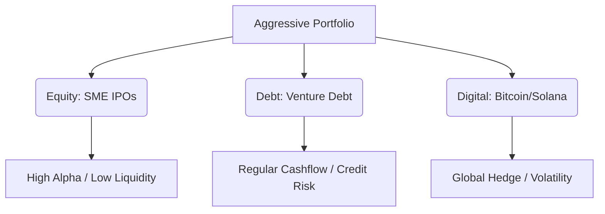

# Exploring High-Risk, High-Reward Investment Opportunities (2026)

In 2026, the "safe" 12% return from mutual funds isn't enough for everyone. The Indian market has opened up sophisticated avenues for retail investors that were previously reserved for the ultra-wealthy.

At **Radii Labs**, we track the flows of "smart money." Here is where the aggressive capital is moving this year.

---

## 1. The SME IPO Boom 🚀

The **BSE SME** and **NSE Emerge** platforms are the hottest casinos in town—but with fundamental backing.
*   **The Appeal:** Companies listing with valuations of ₹50 Cr often see listing gains of 100-300%.
*   **The Risk:** Liquidity is low. If the stock hits a lower circuit, you can be trapped for weeks.
*   **2026 Trend:** Focus on **Green Energy** and **Defense** SMEs.

## 2. Venture Debt: The New Fixed Income 💸

Forget FDs. **Venture Debt** has emerged as a high-yield asset class for retail investors via regulated platforms.
*   **Returns:** 14% to 18% XIRR.
*   **Structure:** You lend money to high-growth startups (like Zepto or BluSmart) for short tenures (12-24 months).
*   **Risk:** Default risk is real. Diversification across 10+ deals is mandatory.

---

## 3. Crypto: The "Blue Chip" Era ₿

By 2026, crypto in India isn't about random meme coins; it's about **regulatory clarity**.
*   **Bitcoin & Ethereum:** Now viewed as digital gold/oil.
*   **DeFi Staking:** Earning 5-8% APY on USD-pegged stablecoins is a popular hedge against INR inflation.
*   **Taxation:** The 30% tax remains, but the *legitimacy* attracts institutional flows.

---

## 4. Small-Cap Momentum Investing 📈

The Nifty Smallcap 250 index is a wild beast. In 2026, the strategy is **Quant-based Momentum**.
*   **Strategy:** Buy stocks hitting 52-week highs with rising volume.
*   **Capital Allocation:** Never more than 5% in a single small-cap stock.

---

## Conclusion & Warning ⚠️

High reward *always* equals high risk.
1.  **SME IPOs** can go to zero liquidity.
2.  **Venture Debt** has no collateral.
3.  **Crypto** can drop 20% in a night.

*Only invest capital you can afford to lose. This is not financial advice.*

