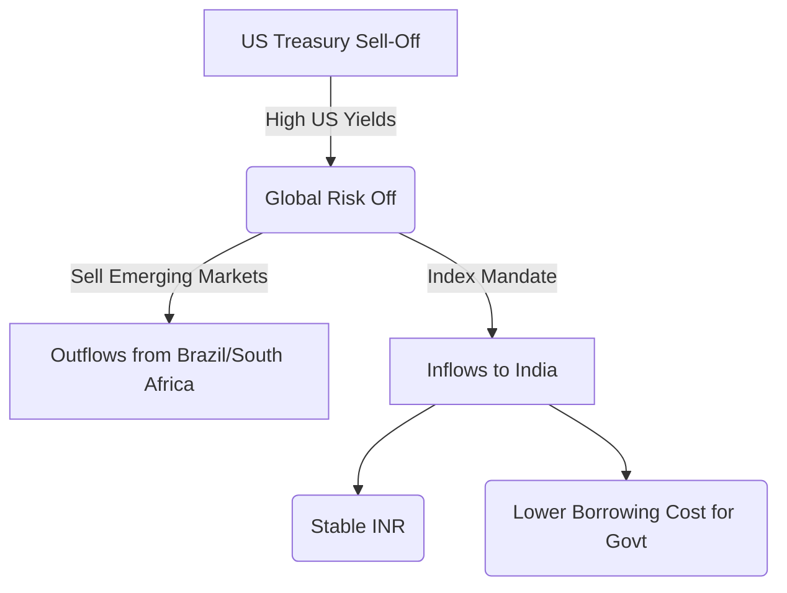

# Global Bond Turmoil: Impact of U.S. Treasury Sell-Off on Indian Markets (2026) 💥📉

The global bond market in 2026 is a battlefield. As the US struggles with its deficit, the "Bond Vigilantes" are back, pushing US 10-Year yields to volatile highs.

But for India, the story is different this time. At **Radii Labs**, we believe India's inclusion in global bond indices has created a "safety buffer" against this turmoil.

---

## The 2026 Context: De-coupling?

Historically, when US yields rose, money left India. In 2026, this correlation is weakening.

| Indicator | US Market (2026) | Indian Market (2026) |
| :--- | :--- | :--- |
| **10-Year Yield** | Volatile (4.1% - 4.5%) | Stable (6.8% - 7.0%) |
| **Foreign Ownership** | Decreasing (China selling) | **Increasing (Index Inclusion)** |
| **Central Bank Action** | Fed: Passive | RBI: Active OMOs (Buying) |

---

## The "Index Inclusion" Effect 🌍

The biggest game-changer of 2026 is the **Bloomberg Global Aggregate Index inclusion**.
*   **The Inflow:** We are seeing **$25 Billion** in passive inflows into Indian Government Bonds (IGBs) this year.
*   **The Impact:** This sticky capital absorbs the selling pressure from active traders spooked by US volatility.

---

## What It Means for You?

### 1. Debt Fund Investors
Long-duration Gilt funds are the place to be. As foreign money pours in, yields will eventually soften, boosting bond prices (NAV).
*   **Radii Labs View:** Accumulate heavily in dynamic bond funds.

### 2. Equity Traders
A stable bond market means the cost of equity remains lower. The "Index Buffer" prevents a liquidity shock to the stock market, even if the US market corrects.

### 3. Currency Hedgers
The Rupee is no longer just at the mercy of the Fed. The structural demand for INR bonds supports the currency floor at ₹91.

---

## Conclusion 🧠

The U.S. Treasury wobble is real, but India is no longer an innocent bystander getting hurt. We have our own gravity now. The **$30 Trillion Global Bond Index** market has opened its doors to India, and that changes everything.

*Data Sources: Bloomberg, RBI, US Treasury Department 2026 Data.*

