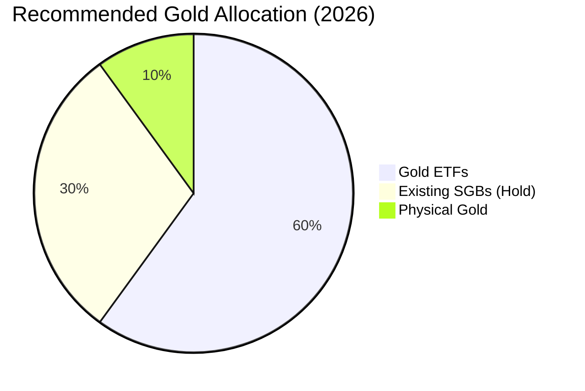

# Gold Investment in 2026: The New Rules of Engagement 🥇

The golden rules have changed. In the growing financial landscape of 2026, the **Government of India** has altered the tax efficiency of the favorite yellow metal.

At **Radii Labs**, we decode what the **2026 Budget** means for your gold portfolio.

---

## The SGB Shock: End of an Era? 🚫

For years, Sovereign Gold Bonds (SGBs) were the undisputed king of gold investing.
**The Change:** As of FY 2026-27, the government has **stopped issuing new SGB tranches**.
**The Tax Trap:** Buying SGBs from the secondary market (BSE/NSE) no longer guarantees Capital Gains Tax exemption.
*   **Old Rule:** Tax-free at maturity.
*   **New Rule (2026):** Secondary market buyers pay tax on gains. Only original subscribers retain the exemption.

This massive shift makes SGBs less attractive for new entrants compared to 2024.

---

## Customs Duty Cut: The 5% Effect 📉

To curb smuggling, the import duty on Gold has been slashed to **5%** (from 6% in 2025).
*   **Impact:** Domestic gold prices have corrected by ₹2,500/10g, narrowing the gap with international rates.
*   **Winner:** Physical Gold buyers (Jewellery/Coins) and ETF investors benefit from lower entry costs.

---

## 2026 Investment Hierarchy

With SGBs losing their shine for new buyers, here is our ranked preference:

### 1. Gold ETFs (Exchange Traded Funds)
The winner for 2026. With the duty cut passed on immediately, ETFs offer the purest exposure to gold prices without the tax ambiguity of secondary SGBs.
*   **Top Picks:** Nippon India Gold ETF, HDFC Gold ETF.

### 2. Digital Gold
Still unregulated by SEBI, but useful for fractional investing (₹100). Be wary of the **3% GST** spread loss.

### 3. Physical Gold
Great for consumption (weddings), terrible for investment due to "Making Charges" (15-20%).

---

## Conclusion

Gold in 2026 is no longer a "blind buy." The SGB tax arbitrage is gone for new buyers.
**Radii Labs Verdict:** Switch your SIPs to **Gold ETFs** and treat physical jewelry as consumption, not investment.

*Disclaimer: This is for educational purposes. Consult your financial advisor.*

