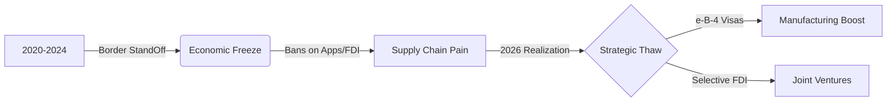

# India-China Trade 2026: A Cautious Thaw? 🇮🇳🇨🇳

After four years of "Deep Freeze," 2026 is witnessing the first signs of a strategic thaw between the Asian giants.
Following the **October 2024 Border Pact** and the resumption of patrolling in Depsang/Demchok, the economic engines are restarting—but with new rules.

At **Radii Labs**, we analyze the three critical shifts defining this relationship in 2026.

---

## 1. The Visa Breakthrough (e-B-4) 🎫

For years, Indian electronics manufacturing (smartphones, EVs) suffered because Chinese technicians couldn't get visas.
**The Change (Jan 2026):** India introduced the **e-B-4 Visa**.
*   **Who is it for?** Chinese technicians, quality inspectors, and supply chain experts.
*   **Impact:** Immediate relief for PLI (Production Linked Incentive) schemes. Factories that were stalled pending machine calibration are now operational.

---

## 2. FDI: Opening the Valve (Slightly) 💰

India is considering a proposal (backed by Niti Aayog) to allow up to **24% Chinese equity** in non-sensitive sectors without automatic security clearance.
*   **Why?** To bridge the $100 Billion trade deficit. Instead of importing finished goods, India wants Chinese firms to **Make in India**.
*   **Reality Check:** Sensitive vectors (Telecom, Power, Data) remain strictly off-limits.

---

## 3. Trade Deficit: The $100 Billion Elephant 🐘

Despite the "Atmanirbhar" push, dependency remains high in critical raw materials.

| Commodity | India's Dependence on China (2026) | Trend |
| :--- | :--- | :--- |
| **Active Pharma Ingredients (API)** | 65% | 🔻 Decreasing (slowly) |
| **Solar Components** | 75% | 🔻 Decreasing (PLI impact) |
| **Electronics Components** | 80% | ➖ Stable |
| **Rare Earth Minerals** | 90% | ➖ Stable (Critical Risk) |

---

## Conclusion: Business, Not Friendship

2026 is not about "Hindi-Chini Bhai Bhai." It is about **Realpolitik**.
India needs Chinese components to become a global export hub. China needs the Indian consumer market as its domestic growth slows.
The relationship has moved from "Conflict" to "transactional Stability."

*Data Sources: Ministry of External Affairs, Department of Commerce (2026 Data).*
