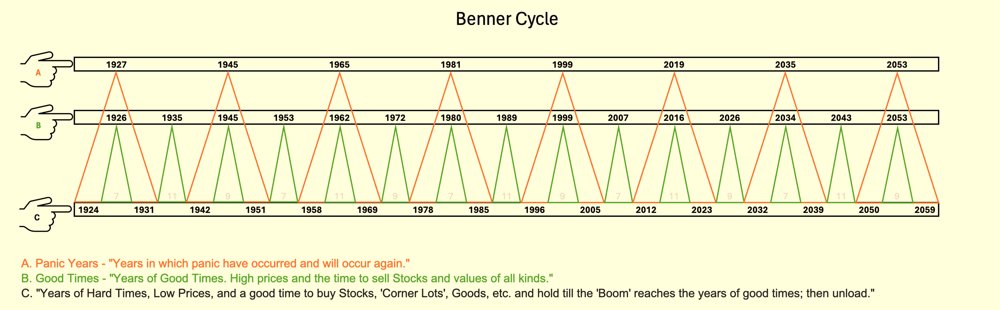

# The Indian Stock Market in 2026: Analyzing Growth Trajectories Through the Benner Cycle 📈📊🚀

### Introduction

The Indian stock market follows cyclical trends influenced by macroeconomic conditions, regulatory frameworks, and global economic shifts. One of the historical models used to predict these cycles is the **Benner Cycle**, which provides insights into economic expansions and contractions. According to this model, 2026 is expected to be a pivotal year characterized by **significant market growth**, sectoral shifts, and increased investor confidence. The expected trajectory of financial markets in India will be shaped by government reforms, monetary policies, capital inflows, and international economic linkages. This article examines the **current market trends**, **sectoral opportunities**, **projected stock valuations**, and **potential risks** that could impact investors in 2027. 💹📉💰

## Current Market Landscape in 2025 🔍📈💡

As of 2025, the Indian stock market has displayed **resilience amid global economic uncertainties**, with steady capital inflows and structural industry shifts. Despite inflation concerns, geopolitical tensions, and sector-specific challenges, the economy remains robust, and markets continue to attract investors.

-   **Nifty 50 Performance**: The **Nifty 50 Index**, a benchmark for India’s stock market, registered a **6.3% gain in March**, closing the fiscal year with an **aggregate increase of 5.34%**. ([Source](https://www.reuters.com/world/india/india-stocks-close-fiscal-2025-higher-march-gains-bail-out-benchmarks-2025-03-28/?utm_source=chatgpt.com)) This gain underscores **investor confidence and corporate earnings growth** in key sectors.
    
-   **Sectoral Growth Trends**:
    
    -   **Banking & Financial Services**: Indian banks have expanded their credit portfolios, with an anticipated **12-13% growth in loan disbursals** in 2026. Fintech disruptors and digital banking innovations contribute significantly. ([Source](https://www.reuters.com/world/india/indias-financial-stocks-fuel-nifty-50s-march-comeback-set-strong-fy2026-2025-03-28/?utm_source=chatgpt.com))
        
    -   **Information Technology (IT)**: The IT sector attracts substantial **foreign capital inflows**, with **TCS**, **Infosys**, and **Wipro** leading the charge. AI, **cloud computing**, and **cybersecurity** drive future expansion. ([Source](https://www.reuters.com/world/india/indias-benchmarks-set-rise-tariff-threat-eases-2025-03-25/?utm_source=chatgpt.com))
        
    -   **Consumer Goods & E-commerce**: Digital commerce continues to boom, driving growth for firms like **Hindustan Unilever** and **ITC**. Improved logistics and increasing internet penetration accelerate sector expansion.
        
    -   **Real Estate**: Fueled by **lower interest rates**, urbanization, and smart city developments, the real estate sector is experiencing robust demand in both commercial and residential spaces. 🏡📊🏗
        

## Key Sectors Poised for Growth in 2026 🔮📈🚀

### 1. Renewable Energy ☀️🌍⚡

India aims to achieve **500 GW of renewable energy by 2030**, boosting firms like **Adani Green Energy**, **Tata Power**, and **JSW Energy**. The government’s renewable energy incentives and **ESG-focused investments** will play a critical role in this sector’s growth. ([Source](https://upstox.com/news/market-news/investing/india-s-fastest-growing-sectors-to-watch-in-2025/article-153016/?utm_source=chatgpt.com))

### 2. Electric Vehicles (EVs) 🚗🔋⚡

EV adoption is accelerating, benefiting **Tata Motors**, **Mahindra Electric**, and **Ola Electric**. With increasing charging infrastructure and government subsidies, the sector is set for **exponential expansion**. ([Source](https://nsestock.com/2025-top-performing-sectors-in-the-indian-stock-market/?utm_source=chatgpt.com))

### 3. Information Technology (IT) 💻🧠🌐

India's **IT sector is projected to reach $350 billion by 2026**, driven by AI, big data, and cloud transformation. Leading firms like **TCS** and **Infosys** are well-positioned to capitalize on this digital shift. ([Source](https://upstox.com/news/market-news/investing/india-s-fastest-growing-sectors-to-watch-in-2025/article-153016/?utm_source=chatgpt.com))

### 4. Healthcare & Pharmaceuticals 🏥💊🔬

With increased healthcare spending, firms like **Sun Pharma**, **Dr. Reddy’s Laboratories**, and **Biocon** will benefit from **biotechnology advancements** and **personalized medicine**. ([Source](https://www.bajajfinserv.in/sectors?utm_source=chatgpt.com))

### 5. Infrastructure Development 🚧🏗🏛

A **₹111 lakh crore** infrastructure push will drive growth for firms like **Larsen & Toubro (L&T)** and **UltraTech Cement**, focusing on **urbanization and smart cities**. ([Source](https://www.financialexpress.com/money/6-high-growth-sectors-to-watch-for-maximum-investment-returns-in-2025-3702037/?utm_source=chatgpt.com))

## Projected Stock Valuations for 2026 📈💰📊

-   **Reliance Industries (RELIANCE)**: Expected **15-20% growth**, driven by investments in **renewable energy and digital infrastructure**.
    
-   **Tata Consultancy Services (TCS)**: Projected **12-18% increase**, reflecting **strong demand for IT services**.
    
-   **HDFC Bank (HDFCBANK)**: Anticipated **10-15% growth**, driven by an increase in loan disbursals.
    
-   **Infosys (INFY)**: Expected to expand **12-18%**, benefiting from **global IT outsourcing**.
    
-   **ICICI Bank (ICICIBANK)**: Projected **10-15% rise**, supported by a strong **financial performance**.
    
-   **Adani Green Energy (ADANIGREEN)**: Estimated **20-30% surge**, due to expanding **renewable energy projects**. 📊💹🚀
    

## Potential Market Risks in 2027 ⚠️📉🔻

-   **Economic Deceleration**: Analysts warn of **overvalued equities**, leading to potential slower growth. ([Source](https://www.reuters.com/world/india/hsbc-downgrades-indian-stocks-neutral-tapering-growth-lofty-valuations-2025-01-09/?utm_source=chatgpt.com))
    
-   **Geopolitical Uncertainty**: Global conflicts and inflationary pressures could trigger **market corrections**.
    
-   **Sector-Specific Risks**: Renewable energy is reliant on **government policies** and **subsidies**.
    
-   **Regulatory & Taxation Changes**: Policy shifts and taxation adjustments could **impact corporate earnings**. 📢🔍🛑
    

## Conclusion 🎯📊💡

Considering **historical market cycles**, **economic indicators**, and **policy measures**, 2026 is **poised to be a bullish year** for Indian equities. However, investors should adopt **diversified strategies** and **risk assessments** to sustain long-term profitability. 🚀💸