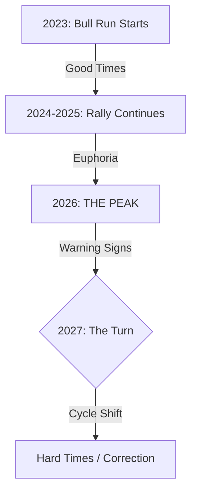

# The Indian Stock Market in 2026: Riding the Benner Cycle Peak? 📈🎢

History doesn't repeat itself, but it often rhymes.
In 1875, Samuel Benner, a prosperous farmer wiped out by the 1873 panic, discovered a cycle in corn and pig iron prices that has uncannily predicted stock market crashes for 150 years.

**The Prediction:** The Benner Cycle marks **2026 as the "Year of Highs"**—the final crescendo before a "Hard Times" cycle begins in 2027.

At **Radii Labs**, we compare this century-old model with modern street consensus.

---

## The Conflict: Cycle vs. Consensus

| Feature | The Benner Cycle Prediction | Wall Street Consensus (2026) |
| :--- | :--- | :--- |
| **2026 Outlook** | **Peak Euphoria (Sell Year)** | **Structural Bull Run** |
| **Nifty Target** | Market Tops Out | 29,000+ (Goldman Sachs/BofA) |
| **Strategy** | **Distribute (Sell)** | **Buy on Dips** |
| **Next Phase** | Panic/Crash (2027-2032) | Continued Growth (India Decade) |

---

## Decoding the Cycle 🔄

The Benner Cycle operates on a 16-18-20 year rhythm.
*   **2023-2026 (Phase B):** "Years of Good Times." We are currently in the final leg of this phase.
*   **2027 (Phase C):** "Years of Hard Times." A cyclical liquidity crunch or recession.

```mermaid
graph TD
    A[2023: Bull Run Starts] -->|Good Times| B[2024-2025: Rally Continues]
    B -->|Euphoria| C[2026: THE PEAK]
    C -->|Warning Signs| D{2027: The Turn}
    D -->|Cycle Shift| E[Hard Times / Correction]
```

---

## Radii Labs Strategy: The "Cautious Bull" 🐂⚠️

We believe 2026 will indeed be a **record-breaking year**. The Nifty could touch **30,000** fueled by domestic liquidity and global rate cuts.
*   **The Trap:** The danger lies in believing "this time is different."
*   **The Move:**
    1.  **Ride the Wave (Q1-Q3 2026):** Stay invested in high-beta sectors (Realty, PSUs).
    2.  **Trim Positions (Q4 2026):** As euphoria hits, start moving profits into **Gold** and **Fixed Income**.

## 3 Sectors to Watch Before the Cycle Turns

1.  **Capital Goods:** The capex cycle usually peaks last. L&T aiming for fresh highs.
2.  **Private Banks:** Valuation comfort protects them from a crash better than mid-caps.
3.  **FMCG:** The classic defensive play for when the "Hard Times" begin.

## Conclusion

Samuel Benner didn't have algorithms, but he understood human psychology. **Greed peaks in cycles.**
2026 is likely the party before the hangover. Enjoy the champagne, but keep an eye on the exit.

*Disclaimer: This is technical theory, not financial advice.*