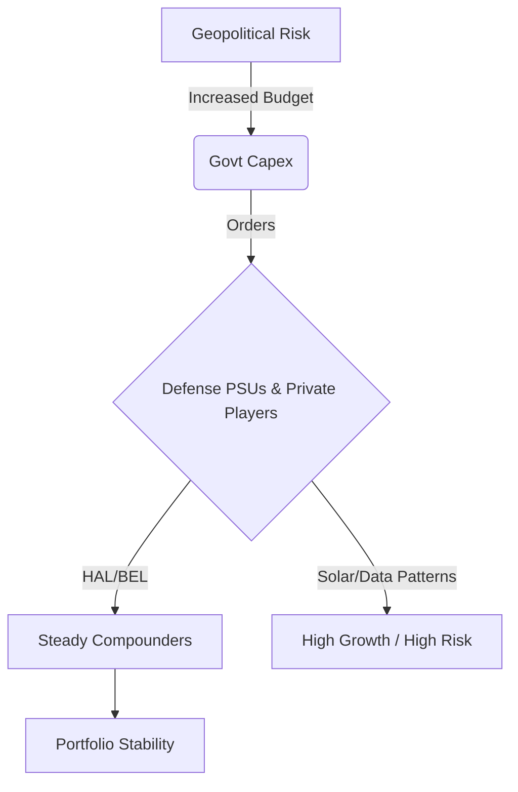

# Investing in the Age of Conflict: The 2026 'Wartime Portfolio' 🛡️🚀

In 2026, peace is expensive, but preparation is profitable.
With global flashpoints active and a "Two-Front" threat on our borders, the Government of India has allocated a record **₹7.85 Lakh Crore** to defense in the 2026 Budget.

At **Radii Labs**, we believe every portfolio needs a "Iron Dome." Here is how to build it.

---

## The "Indigenization" Supercycle 🇮🇳

The days of importing weapons are over. The 2026 theme is **Make in India, for the World**.
*   **Export Target:** ₹50,000 Crore by 2029.
*   **Key Shift:** From simple ammunition to complex systems (Drones, Missiles, Fighter Jets).

---

## Top 5 "Generals" for Your Portfolio 🎖️

We have identified 5 stocks that form the backbone of India's military-industrial complex in 2026.

| Company | Role | Why We Like It (2026) |
| :--- | :--- | :--- |
| **Hindustan Aeronautics (HAL)** | Air Superiority | Monopoly in fighter jets (Tejas Mk2). Order book full for 5 years. |
| **Bharat Electronics (BEL)** | The "Eyes & Ears" | Radars & Electronic Warfare. 15% margins. ZERO debt. |
| **Mazagon Dock** | Naval Power | Submarines & Destroyers. Key beneficiary of the Indian Ocean naval push. |
| **Solar Industries** | Ammunition | Drones & Warheads. The only private player with this scale. |
| **Data Patterns** | Tech/Space | Defense electronics for satellites and missiles. |

---

## Strategy: The 10% Rule

We recommend allocating **10% of your equity portfolio** to the Defense theme.
*   **Volatile but Necessary:** These stocks can be volatile based on order news, but the structural trend is up.
*   **The Hedge:** Defense stocks often rise when the broader market falls due to war fears. They are your portfolio's hedge.

## Conclusion

War is terrible, but ignoring the geopolitical reality is financial negligence.
In 2026, a strong nation needs a strong military, and a strong portfolio needs exposure to the companies building it.

*Disclaimer: Defense stocks are subject to government policy risks. Invest wisely.*
