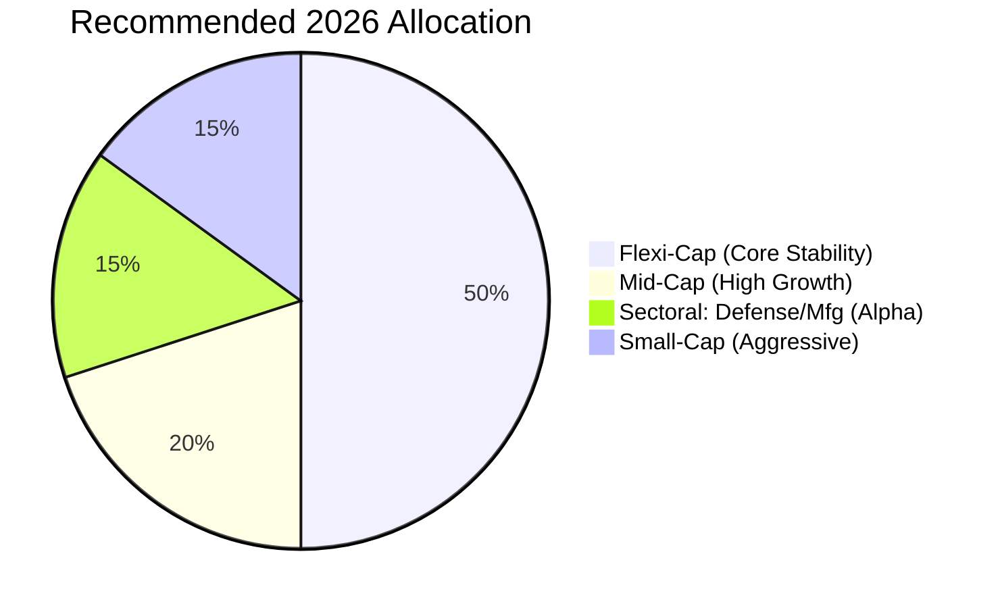

# The 2026 Mutual Fund Playbook: Top Picks & New Tax Rules 📊🇮🇳

Mutual Funds in 2026 are no longer just about "SIP and Forget."
With sector-specific rallies (Defense, Manufacturing) and updated capital gains taxes, investors need a sharper strategy.

At **Radii Labs**, we decode the best funds for the **2026 Bull Run** and explain exactly how much tax you'll pay.

---

## The New Tax Regime (FY 2025-26) 🧾

The days of 10% LTCG are gone. Here is the new reality for Equity Mutual Funds:

| Holding Period | Old Rate | **New Rate (2026)** | Exemption Limit |
| :--- | :--- | :--- | :--- |
| **Short Term (< 12 Months)** | 15% | **20%** | None |
| **Long Term (> 12 Months)** | 10% | **12.5%** | **₹1.25 Lakh** / year |

*Note: Debt funds are now taxed at your income slab rate, removing the indexation benefit.*

---

## Top 3 Themes for 2026 🚀

### 1. The "Bharat Defence" Wave 🛡️
With the government's ₹7.85 Lakh Crore defense budget, defense funds are the top performers.
*   **Top Pick:** **HDFC Defence Fund** or **Motilal Oswal Nifty India Defence Index Fund**.
*   **Why:** Direct exposure to HAL, BEL, and Mazagon Dock.

### 2. Manufacturing Renaissance 🏭
The "China Plus One" strategy is maturing.
*   **Top Pick:** **ICICI Prudential Manufacturing Fund**.
*   **Why:** Heavyweight positions in Auto (Maruti, Tata Motors) and Capital Goods.

### 3. Flexi-Cap Stability ⚖️
For the core portfolio, stick to proven managers.
*   **Top Pick:** **Parag Parikh Flexi Cap Fund**.
*   **Why:** A safe mix of Indian steady compounders and global tech giants (hedging against Rupee depreciation).

---

## How to Build Your 2026 Portfolio 🏗️

## Conclusion

In 2026, **thematic investing** is generating the "Alpha," while **Flexi-caps** provide the stability.
Ensure you factor in the higher **20% STCG tax** before churning your portfolio too often.

*Disclaimer: Mutual Fund investments are subject to market risks. Read all scheme-related documents carefully.*
