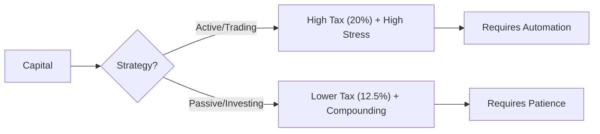

# Long-Term vs. Short-Term Investing in 2026: The Tax & Tech Reality ⏳⚡

In 2026, the debate isn't just about "Patience vs. Adrenaline." It is about **Survival**.
With the government hiking STT on F&O and the dominance of High-Frequency Trading (HFT) algorithms, the playing field has shifted.

At **Radii Labs**, we analyze which style works for *you* in this new regime.

---

## 1. The Tax Hammer (2026 Update) 🔨

The 2026 Union Budget made one thing clear: The government wants you to invest, not gamble.

| Feature | Short-Term (Trading) ⚡ | Long-Term (Investing) 🐢 |
| :--- | :--- | :--- |
| **Capital Gains Tax** | **20% (STCG)** | **12.5% (LTCG)** |
| **STT (F&O)** | **Hiked to 0.15% (Options)** | Nil (Delivery is lower) |
| **Risk Profile** | High (Fighting Algos) | Low (Compounding) |

> [!WARNING]
> **The Algo Threat:**
> In 2026, **70% of derivative volumes** are driven by algorithms. As a manual day trader, you are fighting machines that react in microseconds.

---

## 2. Who Should Trade? (Short-Term) 🏎️

Short-term trading is no longer for the casual punter. It is a **business**.
*   **Viable For:** Algo-traders (using platforms like **Layr0** or Cirrus), Professional Desks.
*   **Strategy:** Scalping small movements using automation.
*   **Reality:** 9/10 retail options traders made losses in FY25 (SEBI Data).

---

## 3. Who Should Invest? (Long-Term) 🌳

Long-term investing remains the "Wealth Cheat Code" for 99% of Indians.
*   **Viable For:** Everyone.
*   **Strategy:** SIPs in Flexi-caps, holding quality Blue Chips (Reliance, TCS) for 5+ years.
*   **Power of 12.5%:** Paying only 12.5% tax (after ₹1.25 Lakh exemption) makes a massive difference to CAGR over 10 years.

---

## Verdict: The 2026 Hybrid Model

Don't choose. **Combine.**
*   **Core Portfolio (90%):** Long-term Blue Chips & Mutual Funds.
*   **Satellite Portfolio (10%):** Swing trading fundamentally strong stocks (avoiding F&O unless automated).

## Conclusion

In 2026, **Time in the Market > Timing the Market**.
Unless you have an algorithm (like **Layr0**), the odds are stacked against the short-term trader.

*Disclaimer: Trading involves risk of loss. Invest responsibly.*

## Expert Insights and Market Outlook

Analysts have weighed in on the resilience of Indian markets amidst global challenges:

> "Indian equity markets are expected to be more resilient to the recent U.S. tariff hikes compared to other Asian economies." — *Analysts at JP Morgan Private Bank and Morgan Stanley* ([Reuters](https://www.reuters.com/world/india/indian-stocks-may-weather-tariff-storm-better-than-asian-peers-analysts-say-2025-04-03/))

Furthermore, projections indicate a potential recovery:

> "Goldman Sachs has projected a 15% recovery for Indian equity markets in 2025, with the Nifty 50 likely to reach 27,000." — *Goldman Sachs Report* ([Economic Times](https://m.economictimes.com/markets/stocks/news/goldman-sachs-sees-nifty-climbing-to-27000-in-2025-upgrades-it-to-overweight/articleshow/115531110.cms))

## Nifty 50 Chart Analysis

For a visual representation and in-depth analysis of the Nifty 50's performance, consider exploring the interactive chart on [TradingView](https://www.tradingview.com/symbols/NSE-NIFTY/). This resource offers real-time data, historical trends, and technical insights to aid investment decisions.

## Conclusion 🧠

The data and expert analyses suggest that while short-term investments in the Indian market are susceptible to volatility and potential losses, a long-term investment strategy tends to yield positive returns. Investors are encouraged to:

- **Adopt a long-term perspective**: This approach helps in mitigating the impact of short-term market fluctuations.
- **Diversify portfolios**: Spreading investments across various sectors can reduce risk.
- **Stay informed**: Regularly monitor market trends, economic indicators, and geopolitical developments to make informed decisions.

By focusing on long-term goals and maintaining a disciplined investment approach, investors can navigate the complexities of the Indian market more effectively.

---

*For further insights and real-time updates, visit [NSE India](https://www.nseindia.com/) and [Bloomberg India Markets](https://www.bloomberg.com/markets/economics).* 📘

