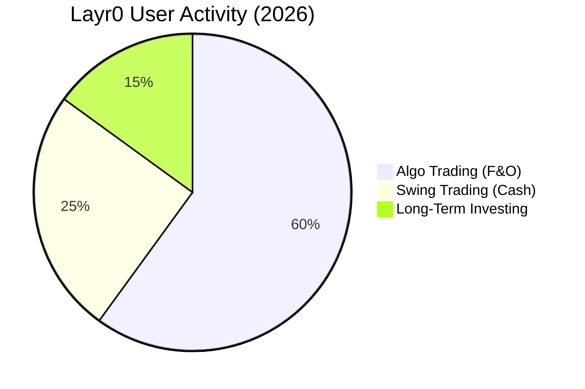

# Revolutionizing Indian Stock Market Trading: The Layr0 Blueprint 🇮🇳🚀

India's retail participation has exploded, with **15 Crore Demat accounts** in 2026.
But quantity does not equal quality. Most retail traders still lose money due to poor execution and delayed data.

**Layr0** is here to democratize "Alpha."

---

## The Problem: Delayed Data, Delayed Reactions ⏱️

In the 2026 market, if you are reacting to news on TV, you are already 10 minutes late.
Institutions trade on **nanosecond** latency tick-data. You trade on **3-second** refreshed charts.

**Layr0 fixes this asymmetry.**

---

## The Solution: Technology as the Great Equalizer ⚖️

We provide retail traders with the same arsenal used by HFT firms.

### 1. Unified Dashboard 🖥️
Trade across **Zerodha, Angel One, and Fyers** from a single screen. No more tab switching during a breakout.

### 2. Smart Order Routing (SOR) 🛤️
Layr0 automatically routes your order to the exchange (NSE/BSE) offering the best price improvement.

### 3. Strategy Marketplace 🛒
Don't know how to code? Rent proven algorithms from India's top quant developers directly on Layr0.

---

## 2026 Sector Outlook: Where to Deploy Layr0? 🔭

| Sector | Why Layr0 Helps |
| :--- | :--- |
| **Banking (Bank Nifty)** | **Volatility:** Catch 100-point swings in seconds with trailing stop-loss bots. |
| **IT (Tech)** | **News:** Auto-buy on positive US earnings data (pre-market). |
| **Defense** | **Momentum:** Ride the "Bharat Defense" trend with trend-following algos. |

---

## Conclusion

The era of "intuition-based" trading is over.
Welcome to the era of **precision**. Welcome to **Layr0**.

*Start your free trial at [Layr0.org](https://layr0.org).*
