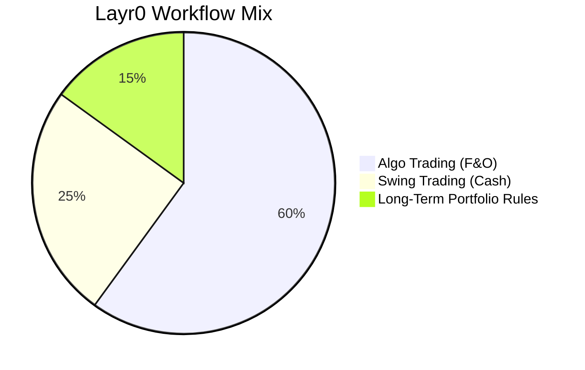

# Layr0 Algo Trading Platform for Indian Markets

India's retail participation has expanded quickly, with millions of demat accounts and more traders using broker apps, APIs, and analytics tools. More participation also creates a practical problem: execution quality, risk discipline, and data workflow matter more than simply placing orders faster.

**Layr0** is designed around that operational layer: broker connectivity, rules-based execution, and clear controls before a strategy reaches live capital.

---

## The Problem: Delayed Data, Delayed Reactions

Manual execution can become inconsistent when market conditions move quickly. Traders may switch between tabs, react late to alerts, or place orders without checking position size, exposure, and broker status.

**Layr0 focuses on reducing that workflow gap.**

---

## The Solution: Technology as an Execution Layer

Layr0 gives traders and teams a structured way to move from signal to order while keeping risk checks visible.

### 1. Unified Dashboard
Review workflows across brokers such as **Zerodha, Angel One, and Fyers** from a single operating view, subject to account and API access.

### 2. Smart Order Routing
Route orders based on broker availability, account rules, instrument type, and risk checks rather than relying on one manual path.

### 3. Strategy Workflow Review
No-code and developer-led workflows can be reviewed for assumptions, cost sensitivity, and risk controls before moving toward live trading.

---

## 2026 Sector Context: Where Workflow Discipline Matters

| Sector | Why execution workflow matters |
| :--- | :--- |
| **Banking and Bank Nifty** | Volatility requires position sizing, stop behavior, and fast rejection of invalid orders. |
| **IT and Technology** | US market cues and earnings events can require clear rules before reacting. |
| **Defense and Manufacturing** | Momentum themes need risk limits so position growth does not outrun the plan. |

---

```mermaid
pie
    title Layr0 Workflow Mix
    "Algo Trading (F&O)" : 60
    "Swing Trading (Cash)" : 25
    "Long-Term Portfolio Rules" : 15
```

## Conclusion

The strongest trading workflows combine research, execution controls, and risk discipline. Layr0 is built for traders who want a more structured process before moving orders through broker-connected systems.

*Risk note: Algorithmic trading can lead to losses. Review strategy assumptions, broker limits, and risk controls before live deployment.*
