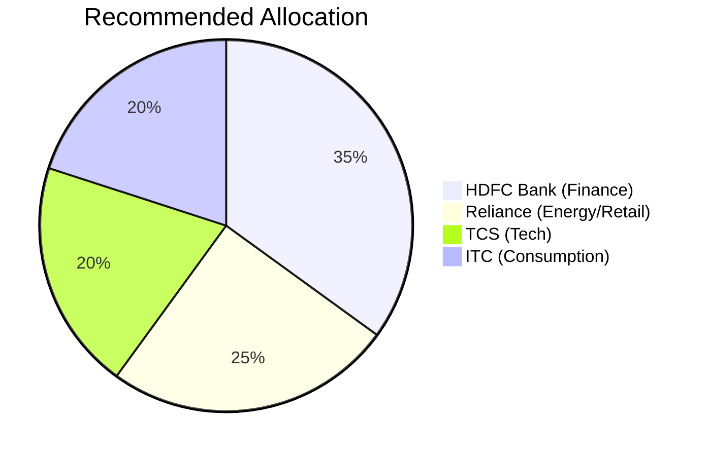

# The 2026 Blue Chip Fortress: 4 Stocks to Anchor Your Portfolio 🏰💎

In a bull market, small caps give thrills. In a bear market, Blue Chips give **sleep**.
With the Nifty 50 projected to cross **28,500** by the end of 2026, the "Elephants" are dancing.

At **Radii Labs**, we decode the 2026 consensus for India's 4 biggest wealth creators.

---

## 1. Reliance Industries (The New Energy Giant) ⚡

Mukesh Ambani's pivot to Green Energy is finally paying dividends in 2026.
*   **2026 Target:** ₹1,847 (Morgan Stanley Consensus)
*   **The Driver:** Value unlocking from the Retail IPO and the start of the Gigafactories.
*   **Verdict:** Buy for the "New Energy" story.

## 2. HDFC Bank (The Merger Monster) 🏦

The post-merger pain is over. 2026 is the year of synergy.
*   **2026 Target:** ₹2,580
*   **The Driver:** Net Interest Margins (NIMs) are back to pre-merger levels (3.8%), and the deposit crunch has eased.
*   **Verdict:** The safest bet in the banking system.

## 3. TCS (The AI Factory) 🧠

While IT services slowed in 2024, TCS is leading the GenAI resurgence.
*   **2026 Target:** ₹3,800
*   **The Driver:** Multi-year AI transformation deals from US banks.
*   **Verdict:** A defensive hedge against global uncertainty.

## 4. ITC (The Undervalued Dividend King) 🚬🍪

The "Meme Stock" of the past is the "Compounder" of 2026.
*   **2026 Target:** ₹381+
*   **The Driver:** FMCG volume recovery and the de-merger of the Hotel business.
*   **Verdict:** Perfect for dividend lovers (4% Yield).

---

## The 2026 Blue Chip Allocation Strategy 🥧

## Conclusion

Volatile markets require stable anchors.
Building a portfolio around these four giants in 2026 ensures you capture the "India Story" without losing sleep over daily volatility.

*Disclaimer: Targets are analyst estimates. Invest wisely.*
