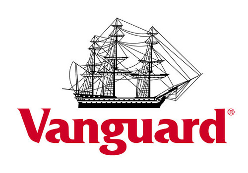

## Introduction

In the labyrinthine world of finance, corporate fund houses are the navigators charting the course for investments across the globe. These titans of industry manage the wealth of nations, steering the collective fortune of millions towards growth and prosperity. Among these giants, BlackRock, Fidelity, and Vanguard emerge as towering figures, shaping the contours of the financial landscape. This article embarks on a journey through the corridors of these behemoths, unraveling their history, influence, and innovations.

## Overview of Top Corporate Fund Houses

Imagine a colossal reservoir where countless streams of capital converge, creating a vast pool of funds ready to be deployed across various asset classes. This is the essence of corporate fund houses. They harness the collective power of numerous investors, channeling these funds into securities, real estate, and alternative investments to achieve tailored financial goals. The sheer scale of their operations grants them unparalleled influence over global markets.

## BlackRock: The Colossus of Wall Street

### History and Background

In 1988, eight visionaries led by Larry Fink planted the seeds of what would become BlackRock, Inc. Originally focused on risk management and fixed income institutional asset management, BlackRock’s ascent to the pinnacle of the financial world is nothing short of meteoric. With over $9 trillion in assets under management (AUM) as of 2023, BlackRock stands as a testament to strategic vision and relentless innovation  .

### Key Facts

- **Headquarters:** New York City, USA
- **CEO:** Larry Fink
- **AUM:** Over $9 trillion (2023)
- **Global Presence:** Offices in over 30 countries
- **Client Base:** Institutional, retail, and high-net-worth clients
- **Website:** [BlackRock](https://www.blackrock.com)

### Impact on Financial Markets

BlackRock's immense AUM is not just a number; it's a force that can sway markets. The firm’s flagship Aladdin platform, a sophisticated risk management tool, is revered across the financial industry. It’s like the central nervous system of global finance, analyzing risk and guiding investment decisions for over 200 financial institutions .

### Notable Achievements and Innovations

- **iShares ETFs:** BlackRock's iShares platform has democratized investing, offering an array of ETFs that provide access to diverse asset classes and markets.
- **Aladdin Platform:** This cutting-edge risk management system is used globally, underscoring BlackRock’s prowess in technological innovation.
- **Sustainability Initiatives:** Leading the charge in ESG (Environmental, Social, and Governance) investing, BlackRock integrates sustainability into its investment strategies, advocating for long-term societal benefits .

## Fidelity: The Vanguard of Customer-Centric Investing

### History and Background

Since its inception in 1946, Fidelity Investments has been a beacon of stability and innovation. Founded by Edward C. Johnson II, Fidelity has navigated the tides of financial change, evolving into a global powerhouse with over $4 trillion in AUM as of 2023. The firm’s legacy is built on a foundation of meticulous research and unwavering commitment to client satisfaction  .

### Key Facts

- **Headquarters:** Boston, Massachusetts, USA
- **CEO:** Abigail Johnson
- **AUM:** Over $4 trillion (2023)
- **Global Presence:** Offices in North America, Europe, Asia, and Australia
- **Client Base:** Individual investors, financial advisors, and institutional clients
- **Website:** [Fidelity](https://www.fidelity.com)

### Impact on Financial Markets

Fidelity’s impact is profound, driven by its robust research capabilities and innovative spirit. The firm offers a plethora of investment options, from mutual funds to sophisticated retirement services. Fidelity’s advanced brokerage platform is a gateway to global markets, providing clients with the tools and insights needed to make informed investment decisions .

### Notable Achievements and Innovations

- **Fidelity Mutual Funds:** With a wide range of mutual funds, Fidelity caters to diverse investment objectives, leveraging deep market insights.
- **Retirement Services:** As a leader in retirement planning, Fidelity provides comprehensive solutions that help individuals secure their financial future.
- **Brokerage Platform:** Fidelity’s cutting-edge platform offers unparalleled access to a broad array of investment products, complemented by powerful research tools and analytics.

## Vanguard: The Champion of Low-Cost Investing

### History and Background

Founded by John C. Bogle in 1975, Vanguard revolutionized the investment world with the introduction of the first index fund, providing a low-cost option for investors to achieve broad market exposure. Vanguard’s unique client-owned structure ensures that profits are returned to investors in the form of lower fees, which has helped the firm amass over $7 trillion in AUM as of 2023  .

### Key Facts

- **Headquarters:** Malvern, Pennsylvania, USA
- **CEO:** Tim Buckley
- **AUM:** Over $7 trillion (2023)
- **Global Presence:** Offices in North America, Europe, Asia, and Australia
- **Client Base:** Individual investors, financial advisors, and institutional clients
- **Website:** [Vanguard](https://www.vanguard.com)

### Impact on Financial Markets

Vanguard’s impact on the financial markets is profound, driven by its commitment to low-cost investing and broad diversification. The firm’s index funds and ETFs are highly regarded for their efficiency and cost-effectiveness, providing investors with exposure to a wide array of asset classes and markets. Vanguard’s emphasis on long-term, disciplined investing has influenced industry practices and investor behavior globally .

### Notable Achievements and Innovations

- **Index Funds:** Vanguard's introduction of index funds revolutionized investing, offering low-cost, broad-market exposure.
- **Client-Owned Structure:** Vanguard's unique structure ensures that any profits are returned to investors, resulting in lower fees.
- **Financial Literacy:** Vanguard is committed to educating investors about the importance of low-cost, diversified investing, promoting financial literacy and empowerment.

## Conclusion

BlackRock, Fidelity, and Vanguard are not just financial institutions; they are architects of the modern financial ecosystem. BlackRock, with its technological innovations and vast AUM, Fidelity, with its customer-centric approach and research excellence, and Vanguard, with its pioneering low-cost investing model, epitomize the dynamic nature of asset management. Their influence permeates every corner of the financial world, guiding the flow of capital and shaping the economic destiny of nations.

For more detailed information, visit their respective websites: [BlackRock](https://www.blackrock.com), [Fidelity](https://www.fidelity.com), and [Vanguard](https://www.vanguard.com).

---

This article is written by an audit peer for Ernst and Young, offering an analytical perspective on the top corporate fund houses.

## References

1. [BlackRock History](https://www.blackrock.com/corporate/about-us/blackrock-history)
2. [BlackRock Financials](https://www.blackrock.com/corporate/investor-relations)
3. [Aladdin Platform](https://www.blackrock.com/aladdin/)
4. [BlackRock ESG Initiatives](https://www.blackrock.com/corporate/sustainability)
5. [Fidelity Investments Overview](https://www.fidelity.com/about-fidelity/overview)
6. [Fidelity Financials](https://www.fidelity.com/about-fidelity/fidelity-by-numbers)
7. [Fidelity Research](https://www.fidelity.com/research/overview)
8. [Vanguard History](https://about.vanguard.com/who-we-are/a-brief-history-of-vanguard/)
9. [Vanguard Financials](https://about.vanguard.com/who-we-are/fast-facts/)
10. [Vanguard Investing Philosophy](https://investor.vanguard.com/corporate-portal/corporate-responsibility/)
