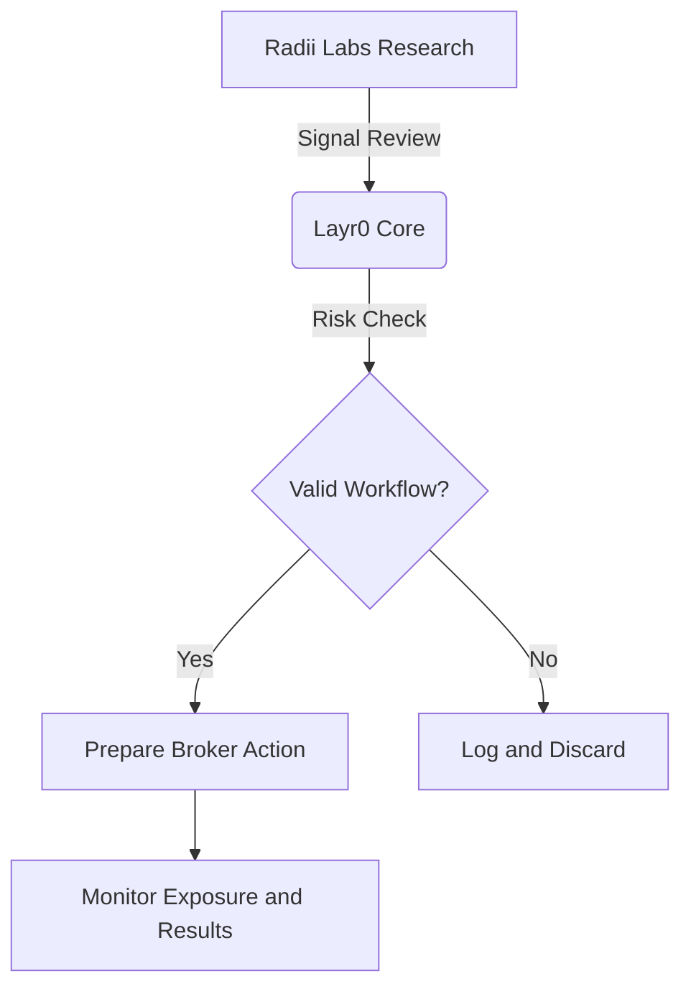

# Layr0 Forex Automation for Global Currency Markets

The global forex market is large, fast, and active across sessions. For traders and teams, the challenge is not constant activity for its own sake. The challenge is deciding which currency workflows should be monitored, which risks should block execution, and when a broker-connected order is appropriate.

**Layr0** supports a more structured approach to currency-market monitoring and execution preparation.

---

## Why Manual Forex Workflows Need Controls

Manual forex trading can be difficult because pairs move across time zones, spreads change, and event risk can appear outside local market hours.

| Workflow Area | Manual Risk | Structured Automation Goal |
| :--- | :--- | :--- |
| **Speed** | Delayed reaction to alerts | Predefined rules and checks |
| **Emotion** | Fear or urgency can override plan | Policy-based approval or rejection |
| **Coverage** | Limited pair monitoring | Multi-pair watchlists with limits |
| **Session Risk** | Missed events or poor timing | Session-aware alerts and controls |

---

## The Layr0 Advantage: From Intelligence to Execution

Layr0 bridges market intelligence, broker access review, and risk checks.

### Key workflow areas:
1. **News-Based Monitoring:** Parse important global events and flag currency pairs for review.
2. **Multi-Broker Routing:** Evaluate which broker or account can support the workflow, subject to access and compliance.
3. **Risk Shield:** Apply stop, exposure, session, and spread rules before any workflow is considered ready.

---

## Conclusion

The forex market rewards discipline more than constant activity. Layr0 is designed for traders and teams that want currency workflows reviewed through risk, broker access, and operational controls before live use.

*Risk note: Forex and currency derivatives involve substantial risk. Permitted instruments, leverage, and broker access vary by jurisdiction and account type.*
