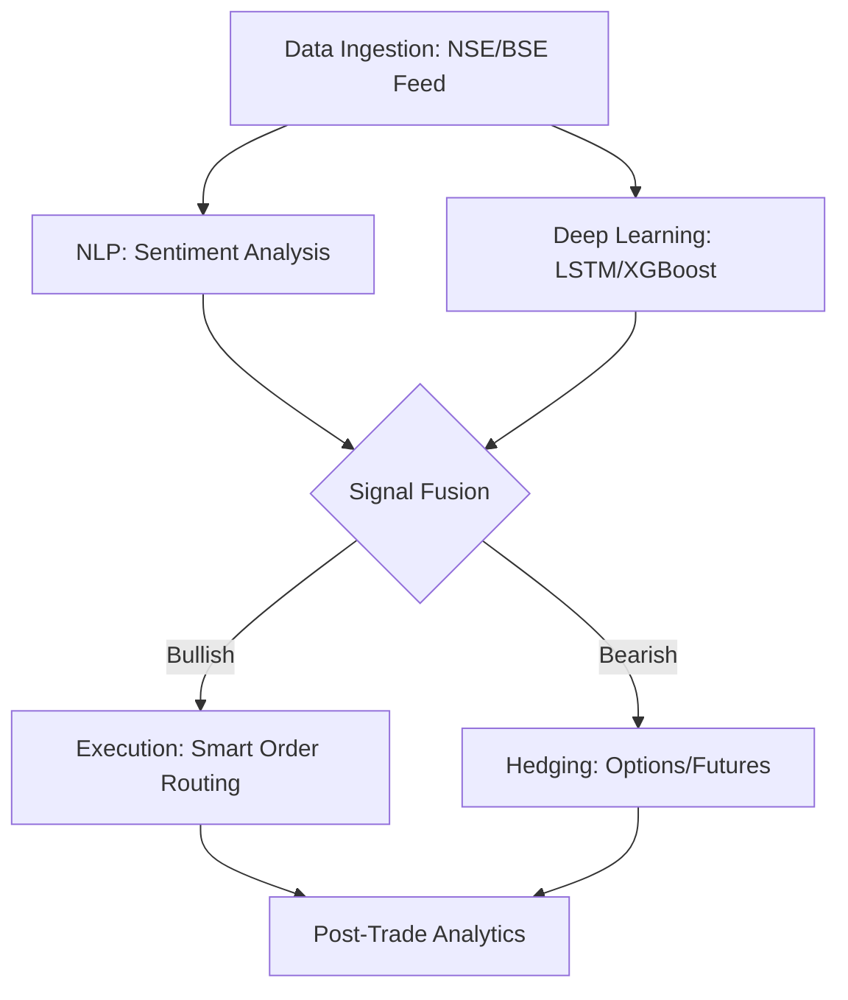
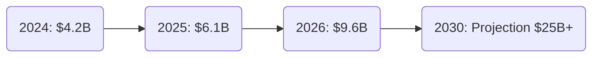

# AI Trading Performance in India (2026): What Actually Works 📈

By 2026, the Indian stock market has undergone a complete digital transformation. With AI-driven automated services reaching a market value of **$1.5 billion**, the question isn't whether to use AI, but which AI models are actually delivering alpha.

At **Radii Labs**, we’ve analyzed performance data across the Nifty 50 and mid-cap segments to identify the strategies that survived the 2026 volatility.

---

## 2026 Performance Benchmarks 📊

AI models didn't just provide speed; they provided superior risk-adjusted returns. Below is the average performance breakdown of AI-managed portfolios vs. Traditional Benchmarks.

| Strategy Type | 2026 Annualized ROI | Max Drawdown | Sharpe Ratio |
| :--- | :--- | :--- | :--- |
| **Traditional Buy & Hold (Nifty 50)** | 14.2% | -12.5% | 1.1 |
| **Sentiment-Driven High Freq** | 22.8% | -8.4% | 1.8 |
| **LSTM-Based Trend Following** | 26.5% | -6.2% | 2.2 |
| **Reinforcement Learning (RL)** | 31.4% | -9.1% | 2.4 |

---

## The Neural Backbone: How the Winners Trade 🔄

The most successful systems in 2026 moved beyond simple moving averages. They utilize a multi-layered approach that combines alternative data (social sentiment) with deep learning.

---

## What Actually Works? The 3 Pillars of 2026 Success

### 1. Sentiment-Price Divergence
In 2026, news moves faster than charts. AI systems that scanned **local news feeds and social sentiment** in real-time were able to anticipate retail frenzies before they reflected in the order book.

### 2. LSTM for Volatility Matching
The Indian market's unique volatility spikes in 2026 required models that could "remember" long-term trends while reacting to short-term noise. **Long Short-Term Memory (LSTM)** networks became the industry standard for predictive analytics.

### 3. Automated Risk Guardrails
It wasn't just about the entry. The highest ROI came from systems with **AI-optimized stop-losses** that adjusted dynamically based on India VIX levels, preventing "flash-crash" liquidations.

---

## The Growth Trajectory 🚀

The adoption of AI in Indian finance continues to accelerate at a CAGR of **30.7%**.

---

## Conclusion

The 2026 data is clear: AI is no longer a luxury for hedge funds. For the Indian retail trader and prop firm alike, leveraging institutional-grade AI models like those developed at **Radii Labs** is the only way to maintain a competitive edge in an increasingly automated environment.

*Disclaimer: Performance data is based on backtested and live-monitored AI strategies. Past performance does not guarantee future results.*
