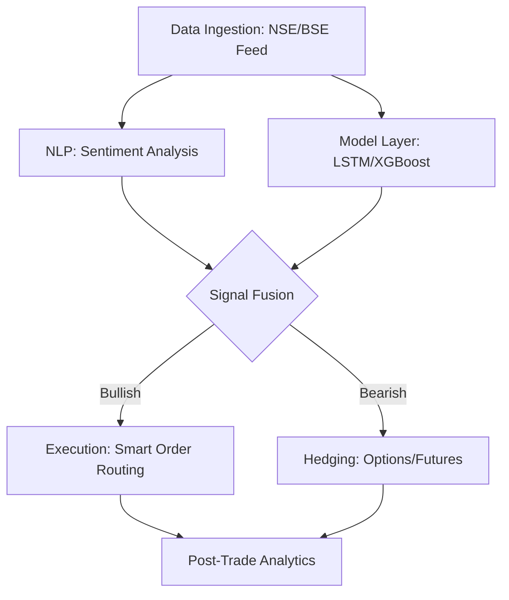
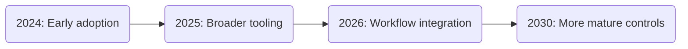

# AI Trading Performance in India (2026): What Actually Works

By 2026, the Indian stock market has undergone a major digital shift. With AI-driven automated services reaching a market value of **$1.5 billion**, the better question is not whether AI matters, but which model types have enough evidence, controls, and operational discipline to deserve further review.

At **Radii Labs**, we review model behavior across the Nifty 50 and mid-cap segments to understand which strategy patterns are more resilient during volatile conditions.

> Methodology note: This article uses illustrative benchmark categories to explain model evaluation. Any real deployment needs data-source review, cost assumptions, slippage checks, liquidity checks, and out-of-sample validation.

---

## 2026 Performance Benchmarks

AI models can provide speed and consistency, but any performance comparison depends heavily on data quality, costs, slippage, and risk assumptions. The table below is an illustrative benchmark framework, not a return forecast.

| Strategy Type | 2026 Annualized Return View | Max Drawdown View | Sharpe View |
| :--- | :--- | :--- | :--- |
| **Traditional Buy & Hold (Nifty 50)** | Benchmark-dependent | Market-dependent | Market-dependent |
| **Sentiment-Driven High Frequency** | Data-dependent | Execution-dependent | Model-dependent |
| **LSTM-Based Trend Following** | Regime-dependent | Volatility-dependent | Model-dependent |
| **Reinforcement Learning (RL)** | Scenario-dependent | Model-dependent | Model-dependent |

---

## The Neural Backbone: How Robust Models Trade

The most resilient systems in 2026 moved beyond simple moving averages. They use a multi-layered approach that can combine alternative data, price behavior, and risk gates.

```mermaid
graph TD
    A[Data Ingestion: NSE/BSE Feed] --> B[NLP: Sentiment Analysis]
    A --> C[Model Layer: LSTM/XGBoost]
    B --> D{Signal Fusion}
    C --> D
    D -->|Bullish| E[Execution: Smart Order Routing]
    D -->|Bearish| F[Hedging: Options/Futures]
    E --> G[Post-Trade Analytics]
    F --> G
```

---

## What Actually Works? The 3 Pillars of 2026 Success

### 1. Sentiment-Price Divergence
In fast markets, news and social context can move before slower chart-based signals. AI systems that scan **local news feeds and social sentiment** may help identify changing market attention, but those signals need strong filters to avoid false positives.

### 2. LSTM for Volatility Matching
The Indian market's volatility spikes require models that can account for longer-term trends while reacting to short-term noise. **Long Short-Term Memory (LSTM)** networks are one approach teams use for sequence analysis, but they still need careful validation and monitoring.

### 3. Automated Risk Guardrails
It is not just about entry logic. More resilient systems include **adaptive stop-loss and exposure rules** that adjust based on volatility measures such as India VIX and reduce the chance of uncontrolled liquidation during sudden market moves.

---

## The Growth Trajectory

The adoption of AI in Indian finance continues to accelerate, but adoption does not remove the need for careful risk review.

```mermaid
graph LR
    2024(2024: Early adoption) --> 2025(2025: Broader tooling)
    2025 --> 2026(2026: Workflow integration)
    2026 --> 2030(2030: More mature controls)
```

---

## Conclusion

The 2026 data points to a practical lesson: AI is most useful when it is paired with clear assumptions, risk controls, and execution discipline. For retail traders, prop firms, and research teams, the goal should be better process quality rather than confidence in any single model output.

*Disclaimer: Performance examples are illustrative and may be based on backtested or monitored strategy categories. Past performance does not guarantee future results.*
