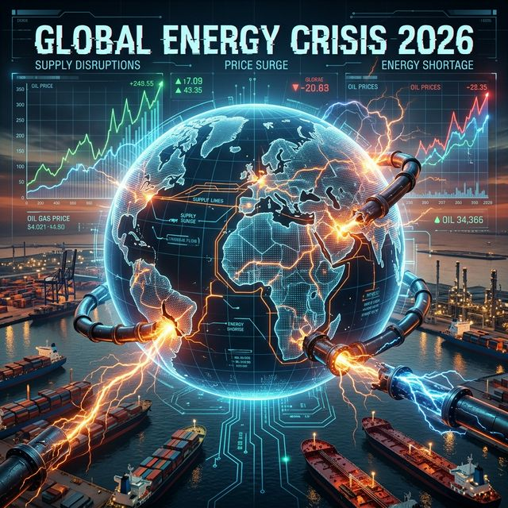
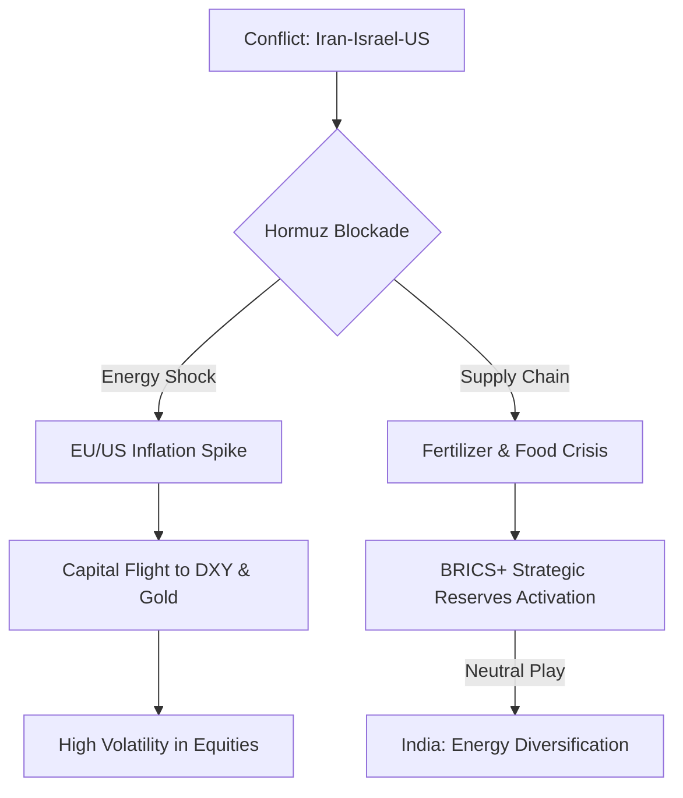

# The 2026 'Oil Shock': Investing During the Iran-Israel-US War 🛢️🌋

As of March 25, 2026, the world is facing its most significant energy disruption since the 1970s. The escalation of the Iran-Israel conflict, now involving direct U.S. kinetic action, has transformed global markets into a high-volatility battlefield.

At **Radii Labs**, we take a neutral, probabilistic view of these events to help you navigate the chaos with disciplined execution.

---

## 2026 Energy Crisis: The Breakdown ⚡

The bombing of **Qatar's critical energy infrastructure** and the subsequent closure of the **Strait of Hormuz** have created a "Force Majeure" event for global LNG and oil supplies.

| Energy Asset | Pre-War Price | Current (Mar 2026) | 90-Day Probabilistic Peak |
| :--- | :--- | :--- | :--- |
| **Brent Crude Oil** | $78.50 | **$104.20** | **$155.00 (60% Probability)** |
| **Natural Gas (TTF)** | €32.00 | **€148.00** | **€210.00 (75% Probability)** |
| **LNG Spot (Asia)** | $12.50 | **$44.80** | **$65.00+ (40% Probability)** |

### The "Qatar Gap" 🇶🇦
Qatar's output represents ~30% of global LNG trade. With infrastructure repairs estimated at **3–5 years**, the EU is now facing a structural energy deficit that cannot be bridged by pipelines alone.

---

## Geopolitical Realignment & Capital Flight 🌍💰

The 2026 conflict has accelerated the shift toward a bifurcated global economy. BRICS+ nations (led by China and India) are attempting to mediate while securing their own energy corridors.

### Safe-Haven Asset Performance (2026)
*   **Gold**: Up 19% YTD, acting as the primary store of value.
*   **US Dollar (DXY)**: Surging as investors flee to the world's most liquid currency.
*   **Bitcoin**: Transitioned into a **High-Beta Asset**; currently range-bound at $60k, struggling to act as a hedge due to liquidity drains in the tech sector.

---

## Surviving Volatility: The Algo Trading Advantage 🤖⚡

In a 24/7 "War Economy," the speed of news and the resulting price gaps make manual trading nearly impossible for retail investors. 

### Why Algorithms Win in 2026:
1.  **Nanosecond Execution**: Capture price improvements before the retail brokers even refresh their charts.
2.  **Emotionless Hedging**: During a "Flash Crash" triggered by a missile strike, an algorithm won't freeze; it will execute your pre-defined stop-loss or hedge.
3.  **Cross-Broker Arbitrage**: In high-volatility events, price spreads between brokers widen. **Layr0** automatically routes your order to the best available liquidity.

---

## The Veridct: Positioning for the "Long Siege"

The 2026 war is not a short-term blip; it is a structural reset of global trade. 
1.  **Hedge with Energy**: Stay long on US and West African energy exports.
2.  **Protect with Gold**: Maintain a 10-15% allocation in physical or digital gold.
3.  **Execute with AI**: Stop gambling with your emotions in a market driven by machine-speed news.

### Ready to level the playing field?
If you're ready to move from emotional bias to data-backed discipline, explore the **Radii Trading Console** and deploy institutional-grade algorithms today.

👉 [**Explore the Radii Console**](https://console.radii.in)

---

*Analysis provided by **Radii Labs Quantitative Research**. Past performance is not indicative of future results.*
