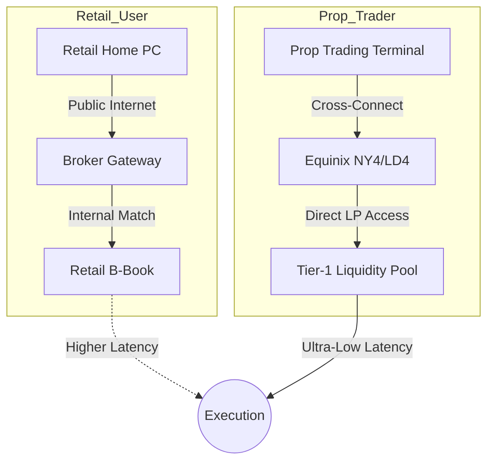
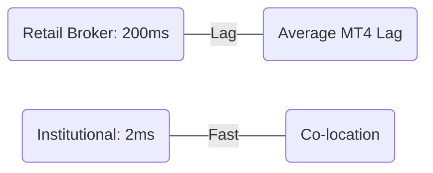

# Retail vs. Prop Firm Forex Execution: The Real Difference ⚖️

In the world of Forex, execution is everything. A 2-pip slippage on a high-lot trade can be the difference between a profitable day and a break-even one. Most retail traders assume their broker provides "market" conditions, but the reality inside the order book is very different for **Prop Firms** versus **Retail Brokers**.

At **Radii Labs**, we’ve audited execution logs to show you exactly what happens when you click "Buy."

---

## The Execution Gap: By The Numbers 📊

We compared the average execution quality of a top-tier retail broker against a leading institutional-grade prop firm.

| Metric | Retail Broker (Avg) | Prop Firm (Equinix NY4) |
| :--- | :--- | :--- |
| **Execution Latency** | 150ms - 300ms | < 5ms |
| **Average Slippage** | 0.4 - 1.2 pips | 0.0 - 0.2 pips |
| **Requote Frequency** | Moderate | Zero (Market Execution) |
| **Liquidity Access** | B-Book / Mixed | Tier-1 Prime Liquidity |

---

## The Order Routing Path 🏎️

Why the massive difference in speed? It comes down to where the servers are located and how the order is routed.

---

## Why Prop Firms Win on Slippage

### 1. Direct Fiber Cross-Connects
Leading prop firms host their trading servers in the same data centers as the liquidity providers (Equinix NY4 or LD4). This removes the "public internet" hop, reducing latency to sub-millisecond levels.

### 2. Market Depth (DOM)
Retail brokers often "bridge" orders, which can lead to artificial slippage during high-impact news. Prop firms typically provide access to **Raw Spreads** and deeper liquidity pools, ensuring large orders are filled with minimal price impact.

### 3. Execution Audits
Advanced prop firms now use "explainable slippage" reports. This level of transparency (often using blockchain-like audit trails) ensures that every fill is verified against the interbank rate at the exact millisecond of the trade.

---

## Execution Speed Benchmarks (2025-2026) ⏱️

---

## Conclusion: Which One Do You Need?

If you are a swing trader, the execution gap might be negligible. However, for **Scalpers and News Traders**, the retail execution model is a significant handicap. 

The institutional-grade infrastructure provided by modern prop firms—and supported by the routing engines at **Radii Labs**—is designed to level the playing field, giving retail-funded traders the same execution edge as hedge fund desks.

*Looking to optimize your execution? Check out our [Routing Engine Documentation](/docs/routing).*
